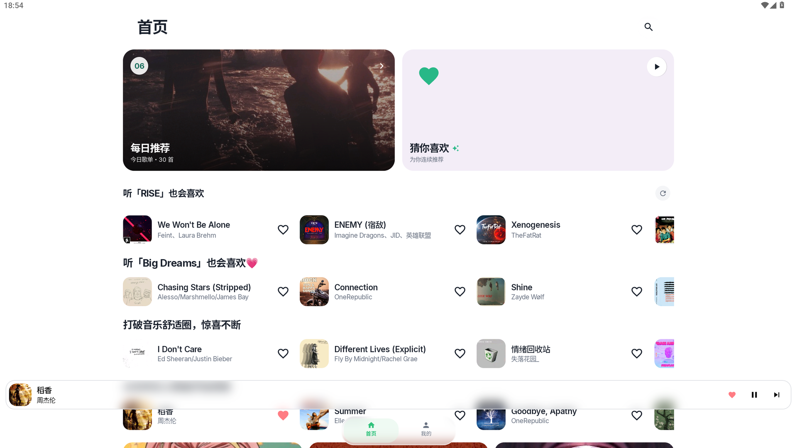
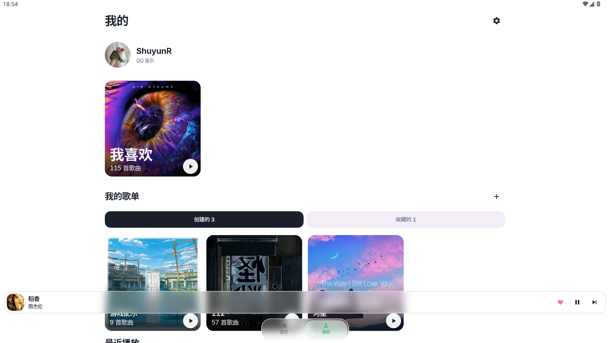
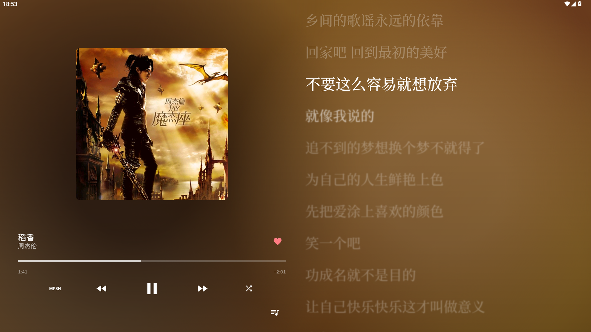
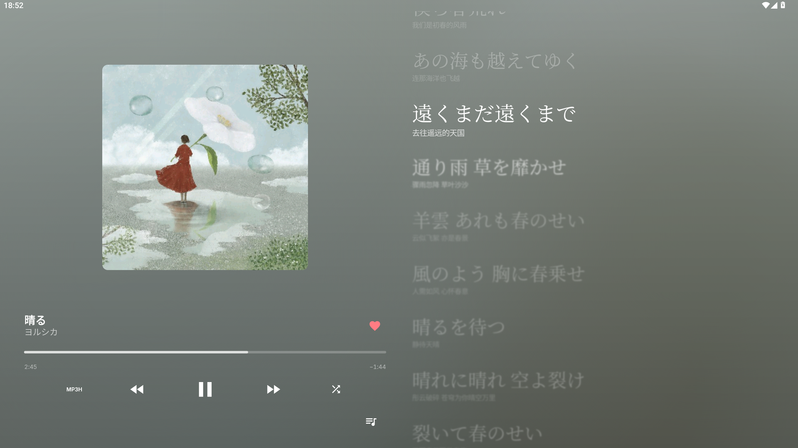
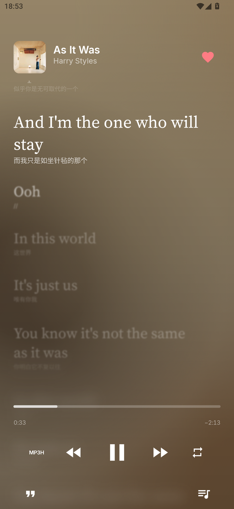
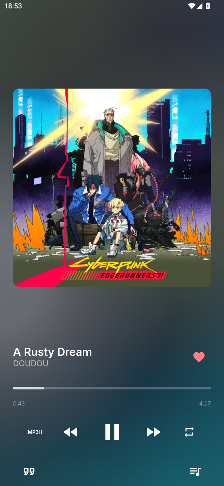

# MusicOne

MusicOne 是一款专注统一视觉、流畅体验与直觉动效的 Android 音乐播放器。

支持在线音乐、动态背景与逐行歌词，结合手势交互，为不同屏幕带来自然一致的聆听体验。

[📥 前往 Releases 下载安装包](https://github.com/HGODLK/MusicOne/releases)

## 界面展示

### 发现音乐与管理歌单

<table width="100%">
  <tr>
    <td align="center" width="50%">首页推荐</td>
    <td align="center" width="50%">我的歌单</td>
  </tr>
  <tr>
    <td></td>
    <td></td>
  </tr>
</table>

### 播放与歌词

<table width="100%">
  <tr>
    <td align="center" width="50%">播放界面</td>
    <td align="center" width="50%">流光歌词</td>
  </tr>
  <tr>
    <td></td>
    <td></td>
  </tr>
  <tr>
    <td align="center">歌词展示</td>
    <td align="center">播放面板</td>
  </tr>
  <tr>
    <td align="center"></td>
    <td align="center"></td>
  </tr>
</table>

## 功能

- **视觉与交互**：界面随屏幕尺寸自适应，支持滑动与手势展开，动态背景颜色随专辑封面变化。
- **播放与歌词**：歌词随播放进度逐行显示，点击歌词可跳转到对应位置。
- **音质与 USB DAC 输出**：支持多档音质切换，可通过外接 USB DAC 进行独占输出（Bit-Perfect）。
- **本地缓存**：支持播放时自动缓存与缓存管理，已完整缓存的曲目可在离线时播放。

## 音源支持

| 平台 | 状态 | 说明 |
| :--- | :--- | :--- |
| **QQ 音乐** | 可用 | 支持推荐、搜索、歌单、个人收藏与播放 |
| **网易云音乐** | 适配中 | 由 [@Killy806](https://github.com/Killy806) 开发；接口调整中，暂不可用 |
| **酷狗音乐** | 适配中 | 接口调整中，暂不可用 |

## 开发者

- **ShuyunR** ([@HGODLK](https://github.com/HGODLK))
- **Killy** ([@Killy806](https://github.com/Killy806)) - 负责网易云音乐模块

## 协议

本项目采用 [MIT License](LICENSE) 开源。
