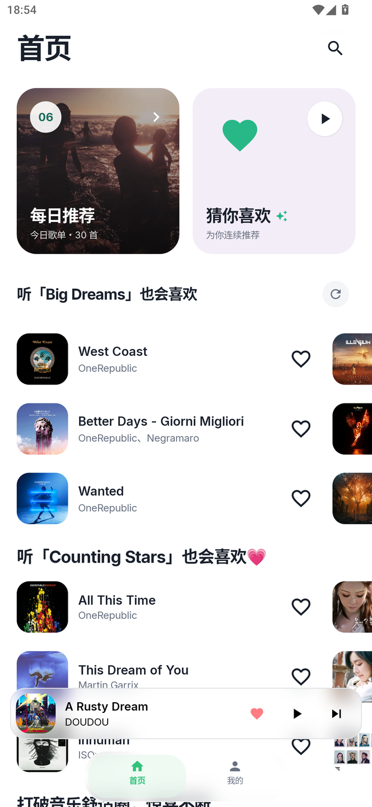
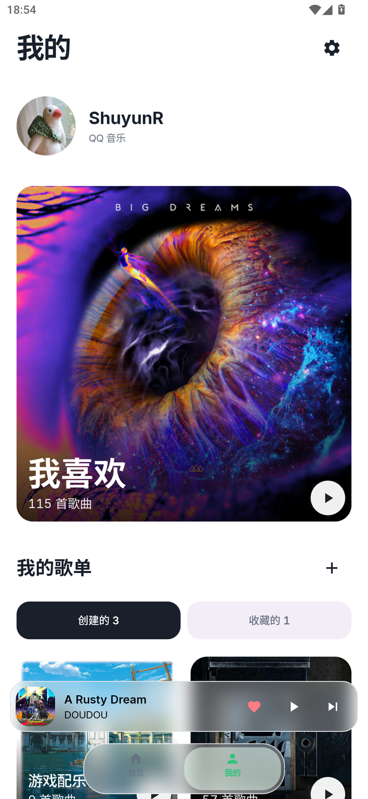

# MusicOne

MusicOne 是一款 Android 音乐播放器，为手机和平板提供适合各自屏幕的界面布局。

支持在线音乐播放、动态背景与歌词显示，也支持本地缓存和外接 USB DAC 音频输出。

## 界面

<table width="100%">
  <tr>
    <td align="center" width="50%">首页推荐</td>
    <td align="center" width="50%">我的歌单</td>
  </tr>
  <tr>
    <td></td>
    <td></td>
  </tr>
  <tr>
    <td align="center" width="50%">双栏播放</td>
    <td align="center" width="50%">流光歌词</td>
  </tr>
  <tr>
    <td></td>
    <td></td>
  </tr>
</table>

<table width="100%">
  <tr>
    <td align="center" width="25%">推荐流</td>
    <td align="center" width="25%">歌单列表</td>
    <td align="center" width="25%">歌词展示</td>
    <td align="center" width="25%">播放面板</td>
  </tr>
  <tr>
    <td></td>
    <td></td>
    <td></td>
    <td></td>
  </tr>
</table>

## 功能

- **手机与平板布局**：手机上支持滑动与手势展开；平板上采用双栏播放界面，同时展示专辑封面、歌词与播放控制。
- **动态背景与歌词**：背景颜色随专辑封面变化，歌词随播放进度逐行显示，点击歌词可跳转到对应位置。
- **音质与 USB DAC 输出**：支持多档音质切换，可通过外接 USB DAC 进行独占输出（Bit-Perfect）。
- **本地缓存**：支持播放时自动缓存与缓存管理，已完整缓存的曲目可在离线时播放。

## 音源支持

| 平台 | 状态 | 说明 |
| :--- | :--- | :--- |
| **QQ 音乐** | 可用 | 支持推荐、搜索、歌单、个人收藏与播放 |
| **网易云音乐** | 适配中 | 由 [@Killy806](https://github.com/Killy806) 开发；接口调整中，暂不可用 |
| **酷狗音乐** | 适配中 | 接口调整中，暂不可用 |

## 开发者

- **ShuyunR** ([@HGODLK](https://github.com/HGODLK))
- **Killy** ([@Killy806](https://github.com/Killy806)) - 负责网易云音乐模块

## 协议

本项目采用 [MIT License](LICENSE) 开源。
