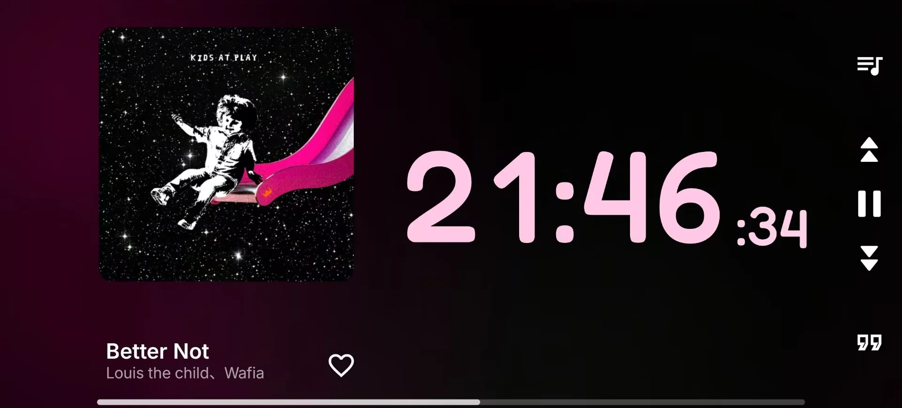
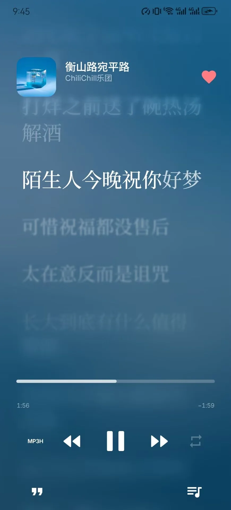
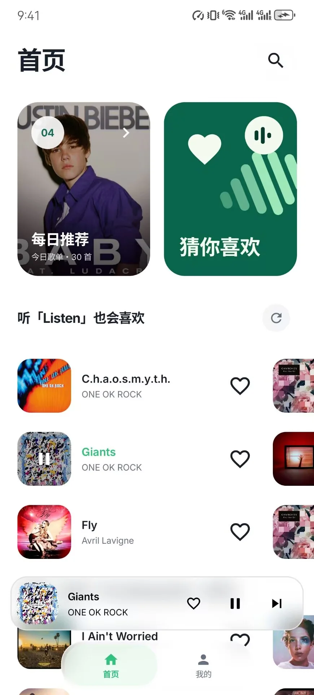
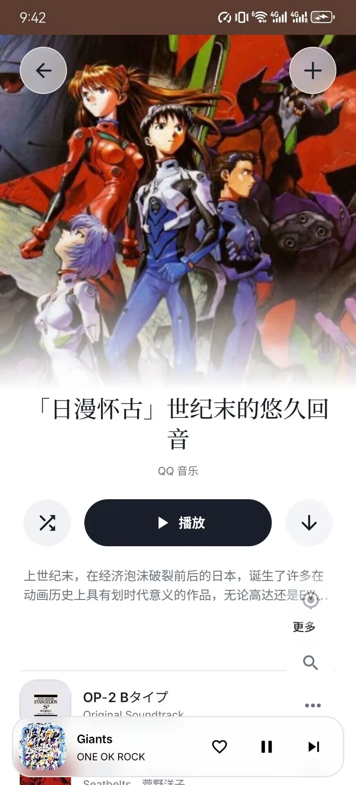
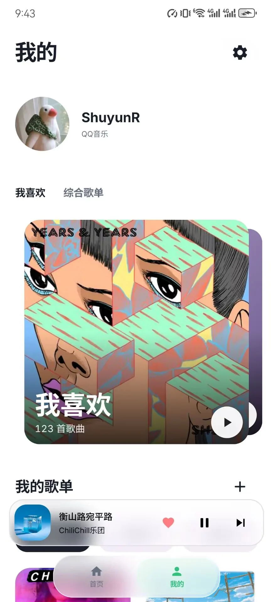
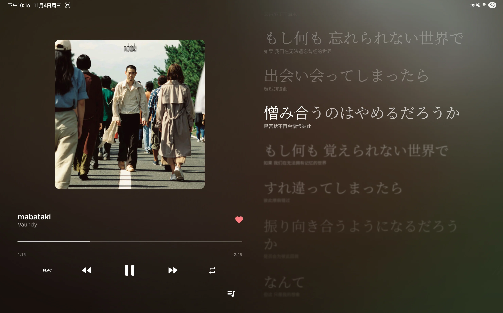
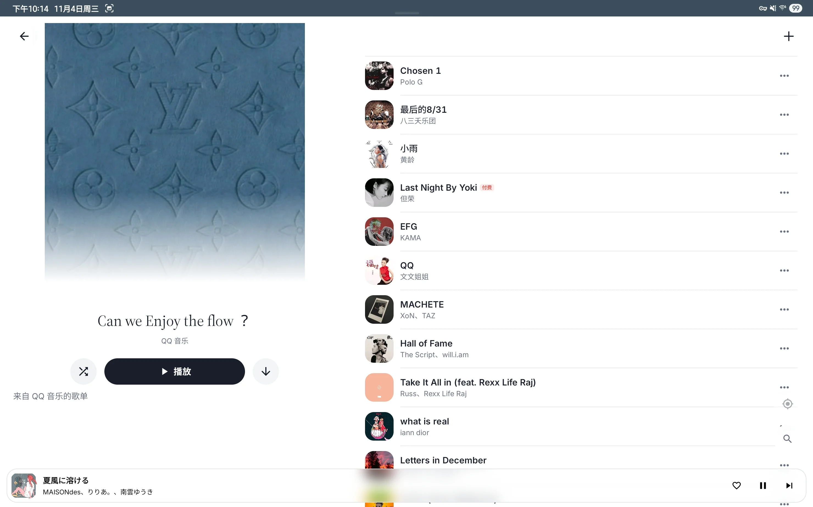
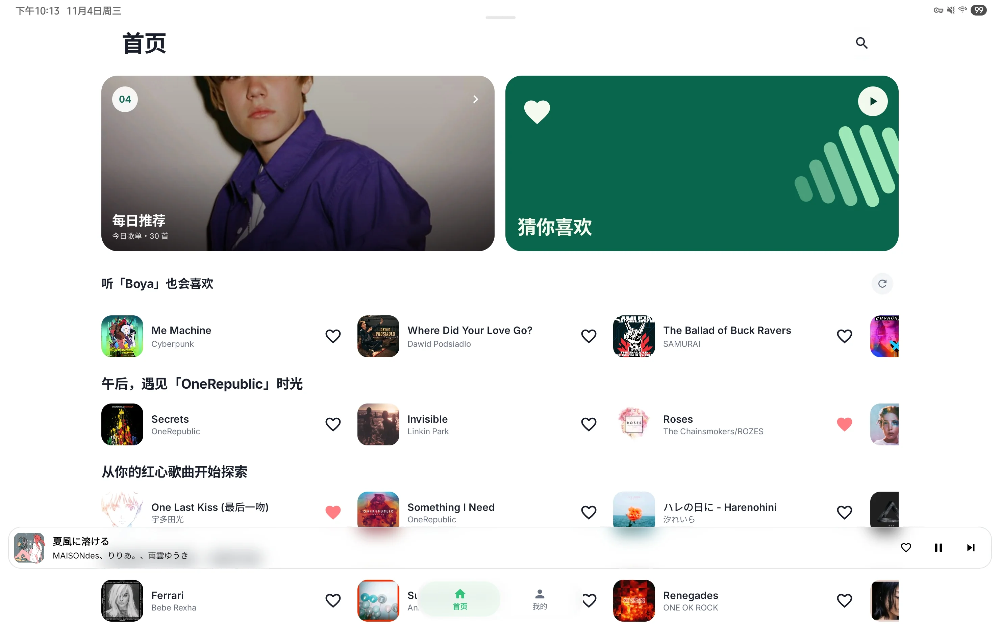
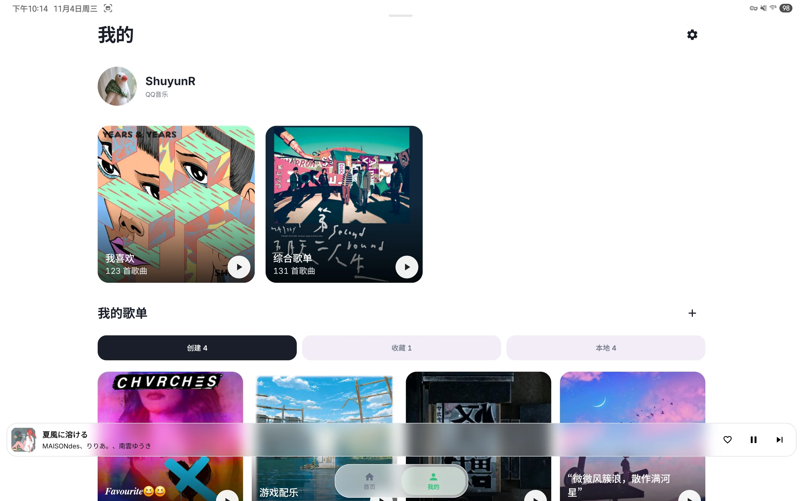

# MusicOne

*专注统一视觉、流畅体验与直觉动效的 Android 音乐播放器*

[📥 下载安装包](https://github.com/HGODLK/MusicOne/releases) • [📡 多音源整合](#-多音源整合) • [📑 歌单体系](#-歌单体系) • [🎼 音频格式](#-本地音频格式支持) • [📖 接入文档](接入文档/README.md)

---

MusicOne 是一款基于 Jetpack Compose 构建的 Android 音乐播放器，支持 Android 6.0 及以上系统。

摒弃繁杂的社交模块与广告推广，专注于顺滑的手势操作、全方向横竖屏连续转屏动效、本地无损解码与纯净音频输出。

应用采用音源解耦架构，主音源作为独立模块运作，与播放核心分离。支持多主音源自由切换。音源开发与扩展规则见[接入文档](接入文档/README.md)。

应用还内置了音乐助手 Mio，可接入 DeepSeek 等大模型服务，使用你自己的 API Key 找歌、推荐和整理歌单。调用产生的 API 费用由用户自行承担，费用高低会因歌单规模而有所不同，歌单越大、需要读取的歌曲越多，费用通常越高。

> **提示**：应用内置 Profile 性能配置。首次启动或更新后，系统后台执行优化时可能短暂发热或掉帧，稍等片刻即可恢复。

  
手机

   
  <table width="100%">
    <tr>
      <td width="50%"></td>
      <td width="50%"></td>
    </tr>
    <tr>
      <td width="50%"></td>
      <td width="50%"></td>
    </tr>
    <tr>
      <td width="50%"></td>
      <td width="50%"></td>
    </tr>
  </table>

  
平板（点击展开）

   
  <table width="100%">
    <tr>
      <td width="50%"></td>
      <td width="50%"></td>
    </tr>
    <tr>
      <td width="50%"></td>
      <td width="50%"></td>
    </tr>
  </table>

## 📡 多音源整合

MusicOne 采用音源解耦设计，各音源作为独立模块运作，划分为**主音源**与**补充音源**：

- **核心分离**：播放核心负责音频解码与队列调度；各音源独立处理界面展示与网络请求，互不影响。
- **主音源与补充音源**：主音源在未被选为主音源时，本质上作为补充音源使用，仍可播放各自歌曲，支持跨源混播；只有被选择为主音源时，才真正承载首页推荐、搜索与个人收藏体系。
- **跨源混播与统一调度**：抹平不同平台的格式与接口差异，支持将不同音源的歌曲加入同一播放队列混合播放；界面自适应匹配曲目所属音源的主题色，直观标识来源。
- **账号权限与原生音质**：在线曲目的播放与音质档位遵循对应平台的账号权限，登录凭据独立保存在本地私有存储，网络请求由客户端直连对应平台，不设中转服务器。
- **数据保留**：更新音源不影响登录；删除音源时，仅清理该音源自身的登录状态与私有数据，本地保存的歌单、播放历史与音频缓存均会保留。

目前提供并内置 qq、kg、wyy、Subsonic 音源；补充音源支持 bili（支持输入Bv号或链接解析播放，亦可同步订阅账号收藏夹）。wyy 暂未适配，可作为补充音源使用。

Subsonic 音源可连接 Navidrome 等自建音乐服务器，目前为预览版，仅在 Navidrome 上做过小规模测试。

## 📑 歌单体系

在“我的”页面中，歌单按入口与管理维度分为两级结构：

- **一级歌单**（常驻核心入口）：
  - **我喜欢**：个人红心收藏主入口，登录后与主音源云端双向同步。
  - **综合歌单**：跨音源常驻歌单，支持将不同音源曲目统一加入其中进行混合管理与播放。
- **二级歌单**（分类歌单列表）：
  - **自建与平台收藏**：承载日常自建歌单与平台收藏歌单，支持多选、排序、编辑及跨源曲目自由组合。
  - **订阅歌单**：隶属于二级歌单的特殊类别，专为外部音频收藏夹等设计，保持与远端更新同步，可直接播放或一键转存至自建歌单。

所有歌单与专辑均支持排序，点击播放时按当前排序顺序播放。

## 🎼 本地音频格式支持

支持 MP3、FLAC、WAV、AAC、M4A、OGG、OGA、OPUS、APE、WV、DSF、DFF、ALAC、AIFF、AIF、MP4 等音频格式，支持外接 USB DAC 独占输出（Bit-Perfect）。

*注：WV 暂不支持 Hybrid 双文件（`.wv` + `.wvc`）；DFF 暂不支持 DST 压缩；DSD 暂不支持 ISO 镜像及 DoP 直出。*

## 👥 开发者与鸣谢

### 开发者

- **ShuyunR** ([@HGODLK](https://github.com/HGODLK)) - 架构设计、交互体系与音频工程

### 音源开发

- **Killy** ([@Killy806](https://github.com/Killy806)) - wyy 音源包开发

### 测试鸣谢

- **Loka**
- **AcFeng-J** ([@AcFeng-J](https://github.com/AcFeng-J))
- **ZJiaYi106** ([@ZJiaYi106](https://github.com/ZJiaYi106))
- **Flam1ng** ([@Flam1ngQAQ](https://github.com/Flam1ngQAQ))
- **几番**
- **Megumi** ([@MegumiTvT](https://github.com/MegumiTvT))

---

感谢开源社区中 FFmpeg、ExoPlayer / Media3 及相关音频开源项目的杰出贡献。

## 📄 开源协议

本项目采用 [GNU General Public License 第 3 版或后续版本](LICENSE)（`GPL-3.0-or-later`）开源，适用于主程序、音源 SDK、项目自有音源包、示例、工具、文档及自有资源。

第三方代码、依赖与资源保留各自的版权和许可证声明，包括原有 MIT、Apache-2.0、LGPL 及字体许可证；项目整体采用 GPLv3 不会替换这些声明。分发本项目或其修改版的二进制时，应遵循 GPLv3 提供对应源码及构建所需的相关脚本。

## ⚠️ 免责声明

请遵守各平台服务条款，使用风险自负。所有在线音源、媒体数据及相关知识产权均归属原始平台与版权方所有，本项目不提供任何音频抓取、越权破解或商业化营利服务。
